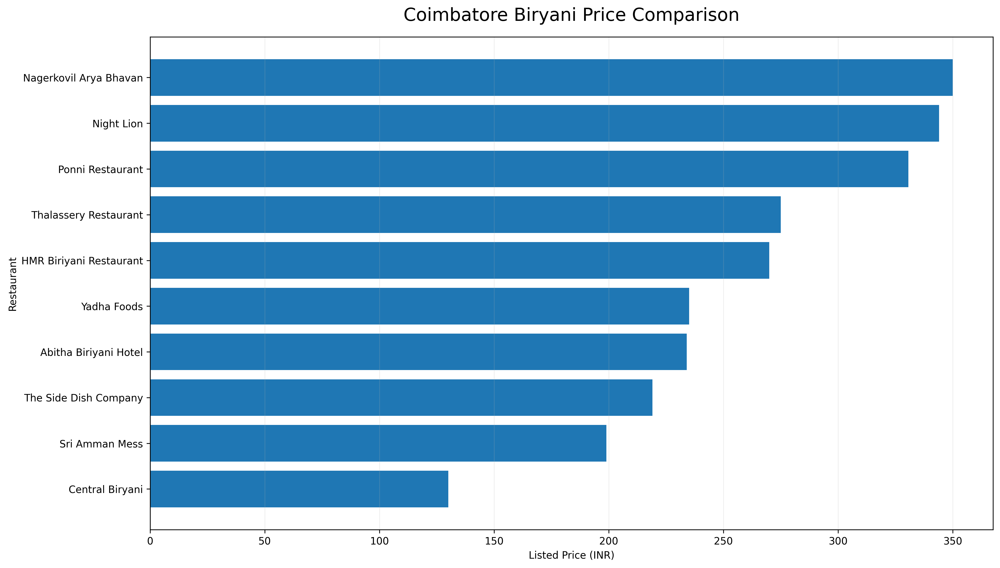

# 🍛 Coimbatore Biryani Market Research & Competitor Analysis

## 📌 Project Overview

This is a self-initiated market research project analyzing selected
biryani restaurants in Coimbatore.

The objective is to compare menu pricing, customer ratings, and
estimated delivery time to identify pricing patterns and potential
value-for-money competitors.

## 🎯 Research Objectives

- Compare biryani prices across selected restaurants
- Analyze customer ratings
- Compare estimated delivery times
- Identify low, mid, and high price segments
- Identify potential value-for-money options
- Present findings in a structured research format

## 🔎 Research Methodology

1. Selected biryani restaurants available in Coimbatore.
2. Collected publicly available listing information.
3. Recorded dish price, rating, and estimated delivery time.
4. Organized the information into a structured dataset.
5. Compared pricing and service indicators.
6. Identified key market observations.

## 📊 Data Fields

| Field | Description |
|---|---|
| Restaurant | Restaurant name |
| Dish | Biryani item analyzed |
| Price | Listed item price in INR |
| Rating | Customer rating shown on the platform |
| Delivery Time | Estimated delivery time |
| Price Position | Relative price segment |

## 📈 Key Findings

### 1. Wide Price Variation

The selected dishes range from approximately ₹130 to ₹350,
showing a significant difference in pricing among competitors.

### 2. Lower-Priced Competitors

Central Biryani and Sri Amman Mess are positioned toward the
lower end of the selected sample.

### 3. Premium Pricing

Nagerkovil Arya Bhavan and Night Lion are among the higher-priced
options in the selected sample.

### 4. Ratings vs Price

Higher prices do not automatically result in the highest ratings.
Some mid-priced restaurants show strong customer ratings.

### 5. Delivery Speed

HMR Biriyani Restaurant shows a relatively short estimated
delivery time in the collected sample, while some higher-priced
restaurants have longer delivery estimates.

## 📊 Price Comparison Chart

The chart compares the listed biryani prices across the selected Coimbatore restaurants.

## 💡 Business Insights

- Competitive pricing can help restaurants attract
  price-sensitive customers.
- Mid-priced restaurants with strong ratings may have a
  potential value-for-money advantage.
- Delivery speed can be an important differentiating factor.
- Restaurants can benchmark their menu pricing against
  nearby competitors.

## 🛠️ Tools Used

- Web Research
- Google Search
- Microsoft Excel / Google Sheets
- Data Collection
- Data Cleaning
- Competitor Analysis
- Basic Data Analysis

## ⚠️ Data Note

The information in this project is based on publicly available
online restaurant listings and is intended for portfolio and
research demonstration purposes.

Prices, ratings, offers, and delivery estimates can change over
time and may vary by location, time, and availability.

## 👨‍💻 About the Researcher

Dinesh Kumar  
MSc Computer Science

Interested in:

- Market Research
- Web Research
- Lead Research
- LinkedIn Research
- Data Collection
- Data Entry
- Product Research

📍 Coimbatore, India# 🍛 Coimbatore Biryani Market Research & Competitor Analysis

## 📌 Project Overview

This is a self-initiated market research project analyzing selected
biryani restaurants in Coimbatore.

The objective is to compare menu pricing, customer ratings, and
estimated delivery time to identify pricing patterns and potential
value-for-money competitors.

## 🎯 Research Objectives

- Compare biryani prices across selected restaurants
- Analyze customer ratings
- Compare estimated delivery times
- Identify low, mid, and high price segments
- Identify potential value-for-money options
- Present findings in a structured research format

## 🔎 Research Methodology

1. Selected biryani restaurants available in Coimbatore.
2. Collected publicly available listing information.
3. Recorded dish price, rating, and estimated delivery time.
4. Organized the information into a structured dataset.
5. Compared pricing and service indicators.
6. Identified key market observations.

## 📊 Data Fields

| Field | Description |
|---|---|
| Restaurant | Restaurant name |
| Dish | Biryani item analyzed |
| Price | Listed item price in INR |
| Rating | Customer rating shown on the platform |
| Delivery Time | Estimated delivery time |
| Price Position | Relative price segment |

## 📈 Key Findings

### 1. Wide Price Variation

The selected dishes range from approximately ₹130 to ₹350,
showing a significant difference in pricing among competitors.

### 2. Lower-Priced Competitors

Central Biryani and Sri Amman Mess are positioned toward the
lower end of the selected sample.

### 3. Premium Pricing

Nagerkovil Arya Bhavan and Night Lion are among the higher-priced
options in the selected sample.

### 4. Ratings vs Price

Higher prices do not automatically result in the highest ratings.
Some mid-priced restaurants show strong customer ratings.

### 5. Delivery Speed

HMR Biriyani Restaurant shows a relatively short estimated
delivery time in the collected sample, while some higher-priced
restaurants have longer delivery estimates.

## 💡 Business Insights

- Competitive pricing can help restaurants attract
  price-sensitive customers.
- Mid-priced restaurants with strong ratings may have a
  potential value-for-money advantage.
- Delivery speed can be an important differentiating factor.
- Restaurants can benchmark their menu pricing against
  nearby competitors.

## 🛠️ Tools Used

- Web Research
- Google Search
- Microsoft Excel / Google Sheets
- Data Collection
- Data Cleaning
- Competitor Analysis
- Basic Data Analysis

## ⚠️ Data Note

The information in this project is based on publicly available
online restaurant listings and is intended for portfolio and
research demonstration purposes.

Prices, ratings, offers, and delivery estimates can change over
time and may vary by location, time, and availability.

## 👨‍💻 About the Researcher

Dinesh Kumar  
MSc Computer Science

Interested in:

- Market Research
- Web Research
- Lead Research
- LinkedIn Research
- Data Collection
- Data Entry
- Product Research

📍 Coimbatore, India
